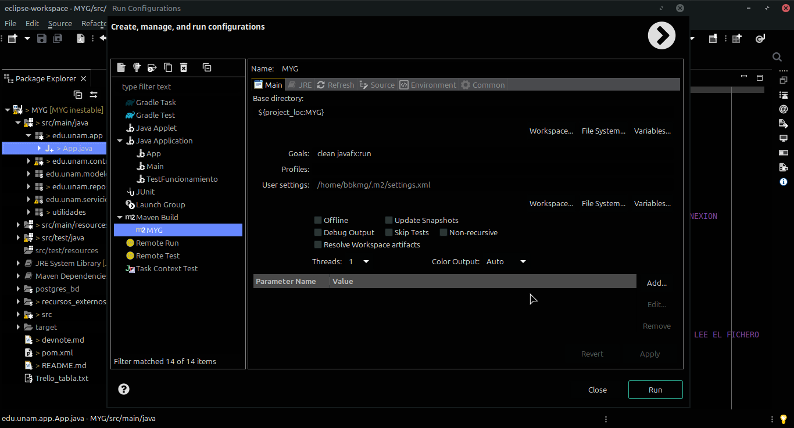

# Sistema de gestión de clientes en java #

Requerimientos:

(jdk)

- java 21+

(maven)

- jakarta-persistence-api 3.1.0
- jakarta-transaction-api 2.0.0
- hibernate-core 6.6.9
- hibernate-hikaricp 6.6.9
- postgresql 42.7.4 (postgreSQL JDBC Driver)
- javafx-controls 21
- javafx-fxml 21

(maven plugin)

- maven-compiler-plugin 3.13.0
- javafx-maven-plugin 0.0.8

---

Para trabajar, probar y modificar:

Clonar el repositorio...
```bash
git clone https://github.com/bbkmg256/MYG.git
```

Posteriormente ejecutar mediante maven (las dependencias se descargarán automáticamente antes de compilar y ejecutar)...
```bash
mvn clean javafx:run
```

O bien desde la IDE que se esté usando, lanzándolo mediante maven, configurando la forma de ejecución y agregando "clean javafx:run" como comando de ejecución...



---

Ramas:

- main -> Rama principal (no tocar!)
- inestable -> Rama para trabajar y hacer cambios
